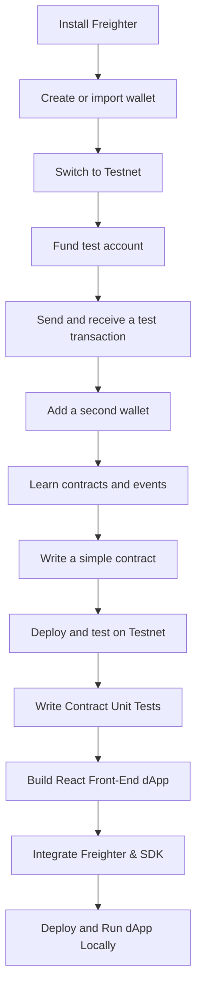
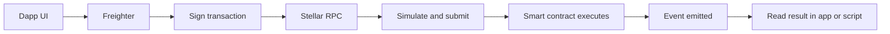

# Stellar Journey to Mastery - Levels 1, 2, and 3 Guide

This repository is a beginner-friendly guide for students starting with Stellar, Freighter, testnet accounts, basic transactions, multi-wallet use, smart contract events, contract compilation, unit testing, and connecting a smart contract to a React frontend (dApp).

## What students will learn

- How to install and use Freighter from the browser web store
- How to create or import a Stellar wallet
- How to switch to Testnet and fund a test account
- How to understand wallets, accounts, and transactions
- How to manage multiple wallets
- How to understand contracts and events
- How to write and test a first simple contract on Testnet
- How to compile and write robust unit tests for Soroban contracts
- How to integrate a Stellar smart contract with a React web interface using Freighter

## Recommended repository structure

```text
stellar-journey-to-mastery/
├── README.md
├── docs/
│   ├── level-1-white-belt.md
│   ├── level-2-yellow-belt.md
│   └── screenshots/
├── projects/
│   ├── level-3-orange-belt/
│   │   └── LandRegistry-dApp/
│   │       ├── LandRegistrySmartContract/  # Rust Soroban Contract
│   │       └── src/                        # React Frontend
│   └── ...
└── assets/
```

## Learning path



## Level 1 - White Belt

### Goal
Learn wallet basics, testnet setup, basic transactions, and how multi-wallet works.

### Concepts
- Wallet
- Account
- Public address
- Network
- Testnet
- Transaction
- Multi-wallet

### Step-by-step

1. Install Freighter from the browser web store.
   - Use Chrome Web Store or Firefox Add-ons.
   - Pin the extension so it is easy to open.

2. Create a new wallet or import an existing one.
   - A new student should normally create a fresh test wallet.
   - Save the recovery phrase safely.

3. Switch the wallet network to Testnet.
   - Do not use Mainnet for training exercises.
   - Make sure the wallet shows the Testnet network before continuing.

4. Fund the test account.
   - Use Friendbot if Freighter offers it for the new test account.
   - You can also fund via Stellar Lab.

5. Learn the wallet basics.
   - The public address is the shareable account ID.
   - The secret phrase or seed must stay private.
   - One wallet can manage more than one account.

6. Send a first test transaction.
   - Copy your address.
   - Send a tiny test amount to another test account.
   - Confirm that the transaction appears on Testnet.

7. Practice multi-wallet switching.
   - Create or import a second account.
   - Switch between accounts.
   - Observe how the active address changes.

### Student practice checklist
- [ ] Installed Freighter
- [ ] Created or imported a wallet
- [ ] Switched to Testnet
- [ ] Funded the account
- [ ] Sent one test transaction
- [ ] Used two wallets and switched between them

### What to submit for Level 1
- Screenshot of Freighter on Testnet
- Screenshot of funded account
- Transaction hash or explorer link
- Short explanation of what you learned

## Level 2 - Yellow Belt

### Goal
Understand multi-wallet use more deeply, read contract events, and write a simple first contract.

### Concepts
- Multi-wallet workflow
- Smart contract
- Contract call
- Event
- RPC
- Testnet deployment
- Basic contract testing

### Step-by-step

1. Review multi-wallet usage.
   - Keep one wallet for testing and one wallet for comparison.
   - Practice switching accounts before signing anything.

2. Learn the contract flow.
   - A dApp prepares a transaction.
   - Freighter signs it.
   - Stellar RPC simulates and submits it.
   - The contract can emit events after execution.

3. Understand events.
   - Events are useful for showing what the contract did.
   - On Stellar, contract events are consumed through RPC-based tooling.
   - Use events to confirm a function ran as expected.

4. Write a simple contract.
   - Start with a tiny contract such as hello world or counter.
   - Keep the first version small and easy to test.
   - Add one function, then test it.

5. Test on Testnet.
   - Deploy the contract to Testnet.
   - Call the function from a script or front end.
   - Check the result and any emitted events.

6. Add basic project structure.
   - Put contract code in a `contracts/` folder.
   - Put test scripts in a `tests/` folder.
   - Put screenshots and notes in `docs/`.

### Student practice checklist
- [ ] Used more than one wallet
- [ ] Understood how a transaction reaches the network
- [ ] Read or displayed a contract event
- [ ] Wrote a small contract
- [ ] Deployed the contract to Testnet
- [ ] Verified the contract output

### What to submit for Level 2
- Contract source code
- Test file or script
- Screenshot of the contract call result
- Screenshot or note showing the event output
- Short explanation of the contract logic

## Mermaid diagram for contract flow



## Level 3 - Orange Belt

### Goal
Build a complete mini dApp (Land Registry), write robust unit tests for the contract, deploy the smart contract on Testnet, and integrate it with a React frontend using Freighter.

### Concepts
- Complete mini dApp workflow
- Rust & Soroban SDK storage structures
- Contract Unit Testing (`cargo test` with mocked auth)
- Contract Deployment via CLI
- Connecting React frontend to Soroban with `@stellar/stellar-sdk`
- Freighter signing via custom service layer

### Project Structure (Land Registry dApp)
The template for this level is located at `projects/level-3-orange-belt`.
It contains:
1. **`LandRegistrySmartContract`**: The Rust-based Soroban contract.
   - `lib.rs`: Exposes `register_property` (checks authorization and saves location/area) and `fetch_property` (reads property from contract instance storage).
   - `test.rs`: Exercises testing the contract locally in a mocked environment.
2. **React Frontend**:
   - `src/components/LandRegistryService.js`: Interface that configures the connection to Stellar RPC, prepares the transaction, requests Freighter to sign it, and submits it to the network.
   - `src/components/RegisterProperty.js` & `FetchProperty.js`: Forms for adding and looking up property registrations on the blockchain.

---

### Step-by-step Guide

#### 1. Compile and Test the Contract
Before deploying your smart contract, verify that its code compiles and passes all unit tests:
1. Navigate to the contract folder:
   ```bash
   cd "projects/level-3-orange-belt/LandRegistrySmartContract/contracts/hello-world"
   ```
2. Run the tests using Cargo:
   ```bash
   cargo test
   ```
   *Note: This will execute the test defined in `src/test.rs` to verify that registering and fetching properties works as expected in a simulated local blockchain environment.*

#### 2. Deploy to Testnet
1. Compile the contract to WASM:
   ```bash
   stellar contract build
   ```
   *(Or run `cargo build --target wasm32-unknown-unknown --release` inside the root Cargo directory).*
2. Deploy the contract:
   ```bash
   stellar contract deploy --network testnet --source-account <your-account-alias> --wasm target/wasm32-unknown-unknown/release/hello_world.wasm
   ```
3. Copy the outputted **Contract ID**.

*(For this project, the deployed testnet Contract ID is: `CBK6DMOHM7I7G3IDNQS7JAJOCJ4XVO5SLXP6KHQAWNVTKW5YHETSE5UA`)*

#### 3. Configure the React App
1. Open the file `projects/level-3-orange-belt/src/components/LandRegistryService.js`.
2. Locate the `CONTRACT_ADDRESS` constant (line 16).
3. Replace the placeholder contract ID with your newly deployed **Contract ID**.

#### 4. Run the dApp Locally
1. Navigate to the React app folder:
   ```bash
   cd "projects/level-3-orange-belt"
   ```
2. Install dependencies:
   ```bash
   npm install
   ```
3. Start the dev server:
   ```bash
   npm start
   ```
4. Open [http://localhost:3000](http://localhost:3000) in your browser. Ensure your Freighter wallet is switched to the **Testnet** network and funded via Friendbot before interacting!

---

### Student practice checklist
- [ ] Compiled the LandRegistry contract using `stellar contract build`
- [ ] Ran the unit tests using `cargo test` and saw them pass
- [ ] Deployed the contract WASM to the Stellar Testnet
- [ ] Configured the React app with the correct deployed contract ID
- [ ] Connected Freighter wallet to the dApp interface
- [ ] Successfully registered a land property (signed the transaction via Freighter)
- [ ] Fetched the registered property details using the resulting ID

### What to submit for Level 3
- The deployed contract ID on Stellar Testnet.
- A screenshot showing `cargo test` passing in your terminal.
- A screenshot of the frontend dApp displaying a successfully fetched property details.
- A short summary explaining how Soroban instance storage is used to persist data in the `LandRegistry` contract.

---

## 💡 Project Ideas by Level

If you are looking for ideas on what to build for each belt level, we have categorized 27 unique Web3 and Stellar-based projects in our dedicated guide:
👉 **[Stellar Project Ideas Guide](PROJECT_IDEAS.md)** (includes details for White, Yellow, Orange, Green, Blue, Black, and Master Belts).

---

## How students should use this repository

1. Read the Level 1 section first.
2. Complete the checklist before moving to Level 2.
3. Advance to Level 3 to learn how to build a full web application on top of your smart contract.
4. Save every project inside the matching level folder.
5. Add screenshots and notes to explain what you built.
6. Keep Mainnet work for later levels.

## Sources consulted for this guide

- Stellar docs: Freighter Wallet
- Stellar docs: Connect to the Testnet
- Stellar docs: Transactions
- Stellar docs: Contract Events
- Stellar docs: Smart contract support and RPC guidance
- Stellar docs: Wallet Integration
- Soroban SDK: Custom storage maps and TTL extension

## Next phase

Levels 4 to 7 can be added later as separate modules:
- Green Belt (Build Production MVP + 10 users)
- Blue Belt (Scale to 50 Users + user feedback)
- Black Belt (Mainnet Launch + Audit)
- Master Belt (Startup track with SCF grants)
