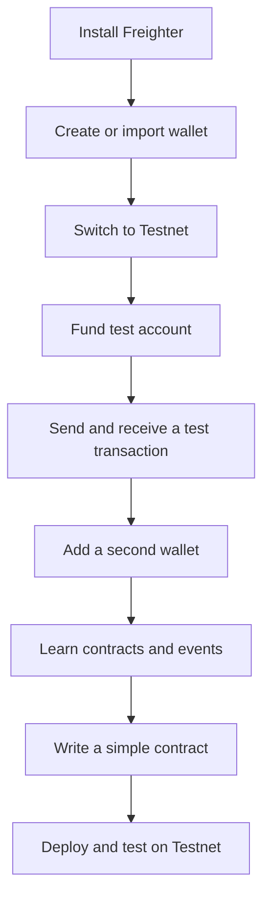
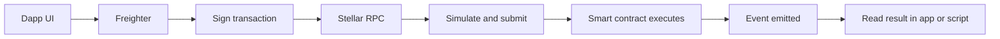

# Stellar Journey to Mastery - Levels 1 and 2 Guide

This repository is a beginner-friendly guide for students starting with Stellar, Freighter, testnet accounts, basic transactions, multi-wallet use, smart contract events, and the first step to writing a contract.

## What students will learn

- How to install and use Freighter from the browser web store
- How to create or import a Stellar wallet
- How to switch to Testnet and fund a test account
- How to understand wallets, accounts, and transactions
- How to manage multiple wallets
- How to understand contracts and events
- How to write and test a first simple contract on Testnet

## Recommended repository structure

```text
stellar-journey-to-mastery/
├── README.md
├── docs/
│   ├── level-1-white-belt.md
│   ├── level-2-yellow-belt.md
│   └── screenshots/
├── projects/
│   ├── level-1/
│   └── level-2/
├── contracts/
└── assets/
```

## Learning path



## Level 1 - White Belt

### Goal
Learn wallet basics, testnet setup, basic transactions, and how multi-wallet works.

### Concepts
- Wallet
- Account
- Public address
- Network
- Testnet
- Transaction
- Multi-wallet

### Step-by-step

1. Install Freighter from the browser web store.
   - Use Chrome Web Store or Firefox Add-ons.
   - Pin the extension so it is easy to open.

2. Create a new wallet or import an existing one.
   - A new student should normally create a fresh test wallet.
   - Save the recovery phrase safely.

3. Switch the wallet network to Testnet.
   - Do not use Mainnet for training exercises.
   - Make sure the wallet shows the Testnet network before continuing.

4. Fund the test account.
   - Use Friendbot if Freighter offers it for the new test account.
   - You can also fund via Stellar Lab.

5. Learn the wallet basics.
   - The public address is the shareable account ID.
   - The secret phrase or seed must stay private.
   - One wallet can manage more than one account.

6. Send a first test transaction.
   - Copy your address.
   - Send a tiny test amount to another test account.
   - Confirm that the transaction appears on Testnet.

7. Practice multi-wallet switching.
   - Create or import a second account.
   - Switch between accounts.
   - Observe how the active address changes.

### Student practice checklist
- [ ] Installed Freighter
- [ ] Created or imported a wallet
- [ ] Switched to Testnet
- [ ] Funded the account
- [ ] Sent one test transaction
- [ ] Used two wallets and switched between them

### What to submit for Level 1
- Screenshot of Freighter on Testnet
- Screenshot of funded account
- Transaction hash or explorer link
- Short explanation of what you learned

## Level 2 - Yellow Belt

### Goal
Understand multi-wallet use more deeply, read contract events, and write a simple first contract.

### Concepts
- Multi-wallet workflow
- Smart contract
- Contract call
- Event
- RPC
- Testnet deployment
- Basic contract testing

### Step-by-step

1. Review multi-wallet usage.
   - Keep one wallet for testing and one wallet for comparison.
   - Practice switching accounts before signing anything.

2. Learn the contract flow.
   - A dApp prepares a transaction.
   - Freighter signs it.
   - Stellar RPC simulates and submits it.
   - The contract can emit events after execution.

3. Understand events.
   - Events are useful for showing what the contract did.
   - On Stellar, contract events are consumed through RPC-based tooling.
   - Use events to confirm a function ran as expected.

4. Write a simple contract.
   - Start with a tiny contract such as hello world or counter.
   - Keep the first version small and easy to test.
   - Add one function, then test it.

5. Test on Testnet.
   - Deploy the contract to Testnet.
   - Call the function from a script or front end.
   - Check the result and any emitted events.

6. Add basic project structure.
   - Put contract code in a `contracts/` folder.
   - Put test scripts in a `tests/` folder.
   - Put screenshots and notes in `docs/`.

### Student practice checklist
- [ ] Used more than one wallet
- [ ] Understood how a transaction reaches the network
- [ ] Read or displayed a contract event
- [ ] Wrote a small contract
- [ ] Deployed the contract to Testnet
- [ ] Verified the contract output

### What to submit for Level 2
- Contract source code
- Test file or script
- Screenshot of the contract call result
- Screenshot or note showing the event output
- Short explanation of the contract logic

## Mermaid diagram for contract flow



## How students should use this repository

1. Read the Level 1 section first.
2. Complete the checklist before moving to Level 2.
3. Save every project inside the matching level folder.
4. Add screenshots and notes to explain what you built.
5. Keep Mainnet work for later levels.

## Sources consulted for this guide

- Stellar docs: Freighter Wallet
- Stellar docs: Connect to the Testnet
- Stellar docs: Transactions
- Stellar docs: Contract Events
- Stellar docs: Smart contract support and RPC guidance
- Stellar docs: Wallet Integration

## Next phase

Levels 3 to 7 can be added later as separate modules:
- Orange Belt
- Green Belt
- Blue Belt
- Black Belt
- Master Belt
